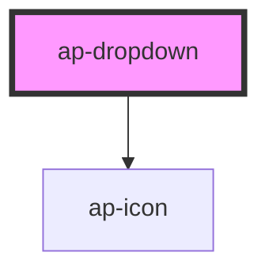

# ap-dropdown

<!-- Auto Generated Below -->

## Properties

| Property      | Attribute     | Description | Type              | Default     |
| ------------- | ------------- | ----------- | ----------------- | ----------- |
| `color`       | `color`       |             | `string`          | `'white'`   |
| `data`        | --            |             | `dropdownItems[]` | `[]`        |
| `placeholder` | `placeholder` |             | `string`          | `undefined` |
| `size`        | `size`        |             | `string`          | `'default'` |

## Events

| Event               | Description | Type               |
| ------------------- | ----------- | ------------------ |
| `clickDropdownItem` |             | `CustomEvent<any>` |

## Dependencies

### Depends on

- [ap-icon](../../foundation/icon)

### Graph

----------------------------------------------

*Built with [StencilJS](https://stenciljs.com/)*
