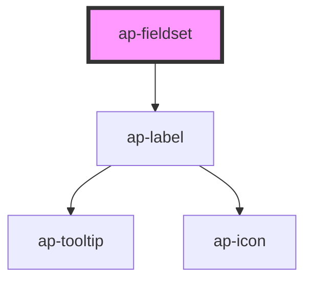

# ap-fieldset

<!-- Auto Generated Below -->

## Properties

| Property   | Attribute  | Description | Type      | Default         |
| ---------- | ---------- | ----------- | --------- | --------------- |
| `color`    | `color`    |             | `string`  | `'primary-500'` |
| `label`    | `label`    |             | `string`  | `undefined`     |
| `required` | `required` |             | `boolean` | `false`         |
| `size`     | `size`     |             | `string`  | `'default'`     |

## Dependencies

### Depends on

- [ap-label](../../foundation/label)

### Graph

----------------------------------------------

*Built with [StencilJS](https://stenciljs.com/)*
