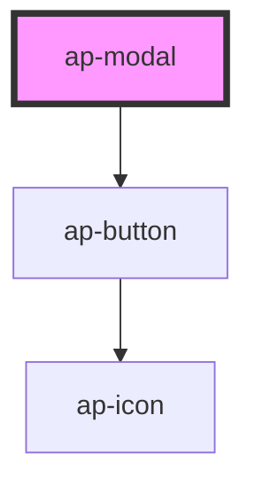

# ap-modal

<!-- Auto Generated Below -->

## Properties

| Property    | Attribute   | Description | Type      | Default     |
| ----------- | ----------- | ----------- | --------- | ----------- |
| `color`     | `color`     |             | `string`  | `'default'` |
| `direction` | `direction` |             | `string`  | `'center'`  |
| `opened`    | `opened`    |             | `boolean` | `false`     |
| `size`      | `size`      |             | `string`  | `'default'` |

## Methods

### `closeModal() => Promise<void>`

#### Returns

Type: `Promise<void>`

### `openModal() => Promise<void>`

#### Returns

Type: `Promise<void>`

## Dependencies

### Depends on

- [ap-button](../../foundation/button)

### Graph

----------------------------------------------

*Built with [StencilJS](https://stenciljs.com/)*
