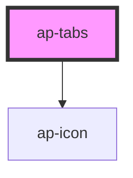

# ap-tabs

<!-- Auto Generated Below -->

## Properties

| Property | Attribute | Description | Type     | Default         |
| -------- | --------- | ----------- | -------- | --------------- |
| `color`  | `color`   |             | `string` | `'primary-500'` |
| `size`   | `size`    |             | `string` | `'default'`     |
| `type`   | `type`    |             | `string` | `'filled'`      |

## Dependencies

### Depends on

- [ap-icon](../../foundation/icon)

### Graph

----------------------------------------------

*Built with [StencilJS](https://stenciljs.com/)*
