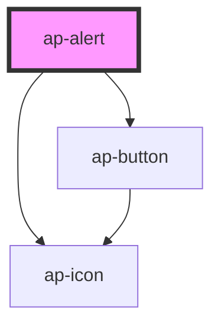

# ap-alert

<!-- Auto Generated Below -->

## Properties

| Property | Attribute | Description | Type      | Default     |
| -------- | --------- | ----------- | --------- | ----------- |
| `close`  | `close`   |             | `boolean` | `false`     |
| `color`  | `color`   |             | `string`  | `'success'` |
| `icon`   | `icon`    |             | `string`  | `undefined` |
| `size`   | `size`    |             | `string`  | `'default'` |

## Dependencies

### Depends on

- [ap-icon](../icon)
- [ap-button](../button)

### Graph

----------------------------------------------

*Built with [StencilJS](https://stenciljs.com/)*
