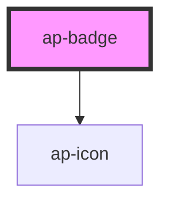

# ap-badge

<!-- Auto Generated Below -->

## Properties

| Property       | Attribute       | Description | Type      | Default         |
| -------------- | --------------- | ----------- | --------- | --------------- |
| `color`        | `color`         |             | `string`  | `'primary-500'` |
| `content`      | `content`       |             | `string`  | `undefined`     |
| `icon`         | `icon`          |             | `string`  | `undefined`     |
| `iconOnly`     | `icon-only`     |             | `boolean` | `false`         |
| `iconPosition` | `icon-position` |             | `string`  | `'left'`        |
| `outlined`     | `outlined`      |             | `boolean` | `false`         |
| `size`         | `size`          |             | `string`  | `'default'`     |
| `text`         | `text`          |             | `boolean` | `false`         |

## Events

| Event          | Description | Type               |
| -------------- | ----------- | ------------------ |
| `clickedBadge` |             | `CustomEvent<any>` |

## Dependencies

### Depends on

- [ap-icon](../icon)

### Graph

----------------------------------------------

*Built with [StencilJS](https://stenciljs.com/)*
