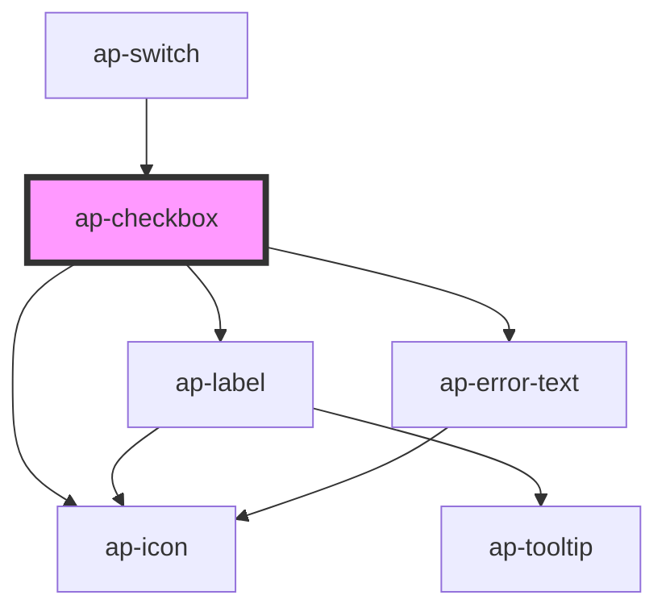

# ap-checkbox

<!-- Auto Generated Below -->

## Properties

| Property        | Attribute        | Description | Type      | Default         |
| --------------- | ---------------- | ----------- | --------- | --------------- |
| `assistiveText` | `assistive-text` |             | `string`  | `undefined`     |
| `border`        | `border`         |             | `boolean` | `false`         |
| `checked`       | `checked`        |             | `boolean` | `false`         |
| `color`         | `color`          |             | `string`  | `'primary-500'` |
| `disabled`      | `disabled`       |             | `boolean` | `false`         |
| `error`         | `error`          |             | `boolean` | `false`         |
| `errorText`     | `error-text`     |             | `string`  | `undefined`     |
| `indeterminate` | `indeterminate`  |             | `boolean` | `false`         |
| `inputId`       | `input-id`       |             | `string`  | `undefined`     |
| `label`         | `label`          |             | `string`  | `undefined`     |
| `required`      | `required`       |             | `boolean` | `false`         |
| `size`          | `size`           |             | `string`  | `'default'`     |

## Events

| Event             | Description | Type               |
| ----------------- | ----------- | ------------------ |
| `clickedCheckbox` |             | `CustomEvent<any>` |

## Methods

### `check() => Promise<void>`

#### Returns

Type: `Promise<void>`

### `unCheck() => Promise<void>`

#### Returns

Type: `Promise<void>`

## Dependencies

### Used by

 - [ap-switch](../switch)

### Depends on

- [ap-icon](../icon)
- [ap-label](../label)
- [ap-error-text](../error-text)

### Graph

----------------------------------------------

*Built with [StencilJS](https://stenciljs.com/)*
