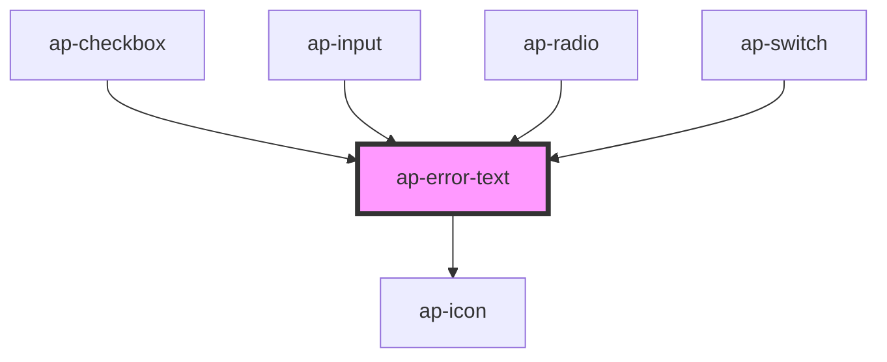

# ap-assistive-text

<!-- Auto Generated Below -->

## Properties

| Property  | Attribute | Description | Type     | Default     |
| --------- | --------- | ----------- | -------- | ----------- |
| `color`   | `color`   |             | `string` | `'default'` |
| `content` | `content` |             | `string` | `undefined` |
| `size`    | `size`    |             | `string` | `'default'` |

## Dependencies

### Used by

 - [ap-checkbox](../checkbox)
 - [ap-input](../input)
 - [ap-radio](../radio)
 - [ap-switch](../switch)

### Depends on

- [ap-icon](../icon)

### Graph

----------------------------------------------

*Built with [StencilJS](https://stenciljs.com/)*
