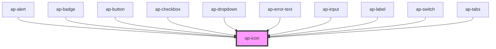

# ap-icon

<!-- Auto Generated Below -->

## Properties

| Property | Attribute | Description | Type     | Default     |
| -------- | --------- | ----------- | -------- | ----------- |
| `icon`   | `icon`    |             | `string` | `undefined` |
| `size`   | `size`    |             | `string` | `'16'`      |

## Dependencies

### Used by

 - [ap-alert](../alert)
 - [ap-badge](../badge)
 - [ap-button](../button)
 - [ap-checkbox](../checkbox)
 - [ap-dropdown](../../components/dropdown)
 - [ap-error-text](../error-text)
 - [ap-input](../input)
 - [ap-label](../label)
 - [ap-switch](../switch)
 - [ap-tabs](../../components/tabs)

### Graph

----------------------------------------------

*Built with [StencilJS](https://stenciljs.com/)*
