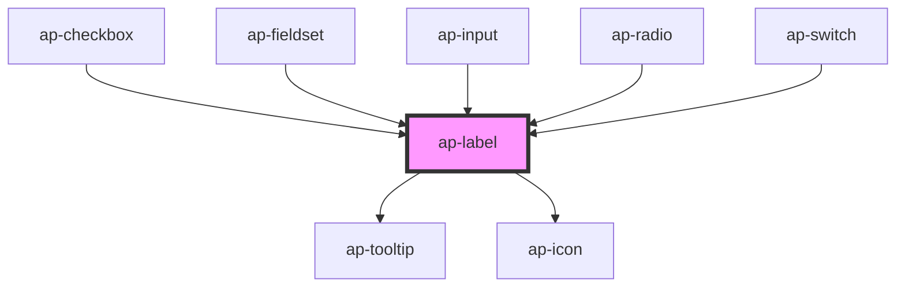

# ap-label

<!-- Auto Generated Below -->

## Properties

| Property        | Attribute        | Description | Type      | Default     |
| --------------- | ---------------- | ----------- | --------- | ----------- |
| `assistiveText` | `assistive-text` |             | `string`  | `undefined` |
| `color`         | `color`          |             | `string`  | `'black'`   |
| `content`       | `content`        |             | `string`  | `undefined` |
| `for`           | `for`            |             | `string`  | `undefined` |
| `required`      | `required`       |             | `boolean` | `false`     |
| `size`          | `size`           |             | `string`  | `'default'` |
| `tooltip`       | `tooltip`        |             | `boolean` | `false`     |

## Dependencies

### Used by

 - [ap-checkbox](../checkbox)
 - [ap-fieldset](../../components/fieldset)
 - [ap-input](../input)
 - [ap-radio](../radio)
 - [ap-switch](../switch)

### Depends on

- [ap-tooltip](../tooltip)
- [ap-icon](../icon)

### Graph

----------------------------------------------

*Built with [StencilJS](https://stenciljs.com/)*
