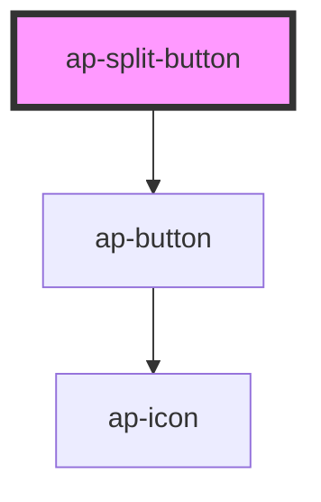

# ap-split-button

<!-- Auto Generated Below -->

## Properties

| Property  | Attribute | Description | Type     | Default         |
| --------- | --------- | ----------- | -------- | --------------- |
| `color`   | `color`   |             | `string` | `'primary-500'` |
| `content` | `content` |             | `string` | `undefined`     |
| `icon`    | `icon`    |             | `string` | `undefined`     |
| `size`    | `size`    |             | `string` | `'default'`     |

## Events

| Event           | Description | Type               |
| --------------- | ----------- | ------------------ |
| `clickedAction` |             | `CustomEvent<any>` |

## Dependencies

### Depends on

- [ap-button](../button)

### Graph

----------------------------------------------

*Built with [StencilJS](https://stenciljs.com/)*
