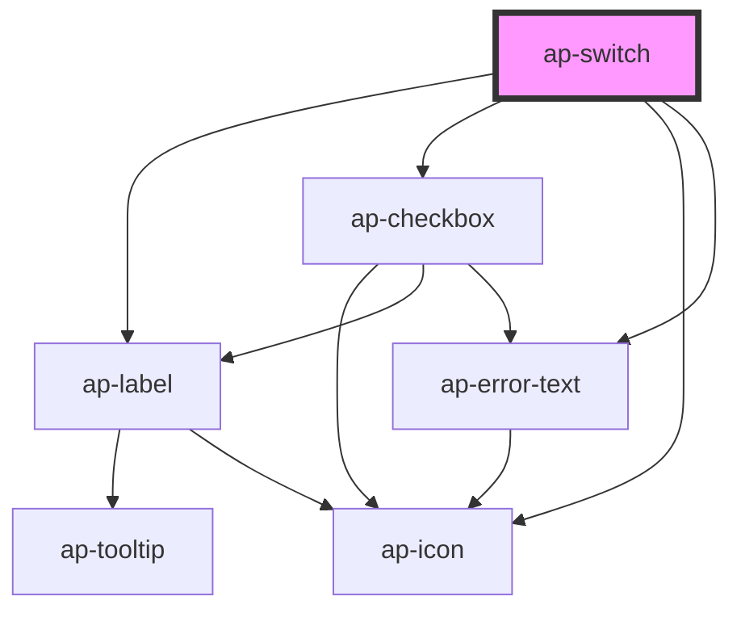

# ap-switch

<!-- Auto Generated Below -->

## Properties

| Property        | Attribute        | Description | Type      | Default        |
| --------------- | ---------------- | ----------- | --------- | -------------- |
| `assistiveText` | `assistive-text` |             | `string`  | `undefined`    |
| `border`        | `border`         |             | `boolean` | `false`        |
| `checked`       | `checked`        |             | `boolean` | `false`        |
| `color`         | `color`          |             | `string`  | `'neutral-50'` |
| `disabled`      | `disabled`       |             | `boolean` | `false`        |
| `error`         | `error`          |             | `boolean` | `false`        |
| `errorText`     | `error-text`     |             | `string`  | `undefined`    |
| `indeterminate` | `indeterminate`  |             | `boolean` | `false`        |
| `inputId`       | `input-id`       |             | `string`  | `undefined`    |
| `label`         | `label`          |             | `string`  | `undefined`    |
| `leadingIcon`   | `leading-icon`   |             | `string`  | `undefined`    |
| `required`      | `required`       |             | `boolean` | `false`        |
| `size`          | `size`           |             | `string`  | `'default'`    |
| `trailingIcon`  | `trailing-icon`  |             | `string`  | `undefined`    |

## Events

| Event          | Description | Type               |
| -------------- | ----------- | ------------------ |
| `clickedRadio` |             | `CustomEvent<any>` |

## Dependencies

### Depends on

- [ap-label](../label)
- [ap-checkbox](../checkbox)
- [ap-icon](../icon)
- [ap-error-text](../error-text)

### Graph

----------------------------------------------

*Built with [StencilJS](https://stenciljs.com/)*
