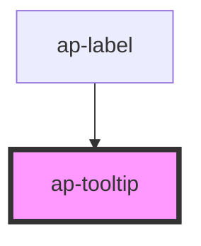

# ap-tooltip

<!-- Auto Generated Below -->

## Properties

| Property    | Attribute   | Description | Type     | Default     |
| ----------- | ----------- | ----------- | -------- | ----------- |
| `content`   | `content`   |             | `string` | `undefined` |
| `placement` | `placement` |             | `string` | `'bottom'`  |

## Dependencies

### Used by

 - [ap-label](../label)

### Graph

----------------------------------------------

*Built with [StencilJS](https://stenciljs.com/)*
